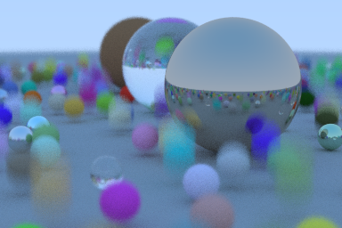

# RayTracingTheNextWeek

An implementation of the book [Ray Tracing: The Next Week](https://raytracing.github.io/books/RayTracingTheNextWeek.html).  

## Table of Contents

- [Prequel](#prequel)
- [Programs](#programs)
  * [0. Motion Blur](#0-motion-blur)
  * [1. Bounding Volume Hierarchies](#1-bounding-volume-hierarchies)
  * [2. Solid Textures](#2-solid-textures)
  * [3. Perlin Noise](#3-perlin-noise)
- [Library](#library)
- [Documentation](#documentation)
- [Building](#building)
- [Build Status](#build-status)

## Prequel

You can check out the implementation to the prequel, [Ray Tracing in One Weekend](https://raytracing.github.io/books/RayTracingInOneWeekend.html), over at [RayTracingInOneWeekend](https://github.com/moddyz/RayTracingInOneWeekend).

## Programs

### 0. Motion Blur



Simulate the effect of motion blur, by introducing the concept of time to rays and scene objects.

Rays are fired at random times between *shutter open* and *close* to produce the averaged image across that time interval.

Scene objects now possess *attributes*.  Attributes store values for multiple time samples, and supports 
queries between, or beyond available samples.  For more information, see the [class documentation for Attribute](https://moddyz.github.io/RayTracingTheNextWeek/classAttribute.html).

[Source code](./src/0_motionBlur/main.cpp)

[Link to Chapter 2](https://raytracing.github.io/books/RayTracingTheNextWeek.html#motionblur)

### 1. Bounding Volume Hierarchies


Introducing bounding volume hierarchy (BVH) to accelerate the ray tracing.  The BVH reduces the number of
intersection tests performed per-ray by pruning out hierarchies of scene objects whose bounding volume does not 
intersect with the ray.

With the same scene from [0. Motion Blur](#0-motion-blur):
- With BVH: **10.575s**
- Without BVH: **216.854s**

Measurements taken using the `time` Linux command line utility, on a Thinkpad X1 Extreme outfitted 
with Intel(R) Core(TM) i7-9750H CPU @ 2.60GHz.

[Source code](./src/1_boundingVolumeHierarchies/main.cpp)

[Link to Chapter 3](https://raytracing.github.io/books/RayTracingTheNextWeek.html#boundingvolumehierarchies)

### 2. Solid Textures


Introducing textures to sample colors from.  Textures are available as a type of material parameter, such
as the "albedo" parameter for Lambert.

In the image above, the ground plane is assigned a Lambert material with a CheckerTexture for its albedo parameter.

[Source code](./src/2_solidTextures/main.cpp)

[Link to Chapter 4](https://raytracing.github.io/books/RayTracingTheNextWeek.html#solidtextures)

### 3. Perlin Noise


Introduced a Perlin noise generator, for producing smooth noise.  

By accumulating multiple layers of perlin noise applied to a sine function over the Z-coordinate, a marble-like texture is generated.

[Source code](./src/3_perlinNoise/main.cpp)

[Link to Chapter 5](https://raytracing.github.io/books/RayTracingTheNextWeek.html#perlinnoise)

## Library

Common functions and classes are refactored into the [raytrace library](./src/raytrace) and the [GraphicsMath](https://github.com/moddyz/GraphicsMath) project.

## Documentation

Doxygen documentation based on the latest state of master, [hosted by GitHub Pages](https://moddyz.github.io/RayTracingTheNextWeek/).

## Building

A convenience build script is provided, for building all targets, and optionally installing to a location:
```
./build.sh <OPTIONAL_INSTALL_LOCATION>
```

### Requirements

- `>= CMake-3.17`
- `C++17`
- `doxygen` and `graphviz` (optional for documentation)

## Build Status

|       | master | 
| ----- | ------ | 
| macOS-10.14 | [](https://travis-ci.com/moddyz/RayTracingTheNextWeek) |
